## Rietveld refinement of powder X-ray diffraction pattern using FullProf

Step by step guide to getting started with powder x-ray diffraction peak fitting
using FullProf.

#### Installation

Please download the FullProf software [here](
http://www.ill.eu/sites/fullprof/php/downloads.html) and
follow the instructions to install in your computer. I am using a Windows
machine for this tutorial. The sample data used in this tutorial is available
[here](http://dx.doi.org/10.17632/x6ph2nkrmm).

#### Creating PCR File

1. First of all, it is recommended that you always create a new (separate)
directory for the FullProf analysis of each of your samples. Like for example,
now I want to do the analysis of CeMg3, so I will create `D:\FullProf\CeMg3`

2. Copy the powder XRD data file to the folder created (i.e., to
`D:\FullProf\CeMg3`). Generally, this XRD data file is an ASCII file with the
extension `.x_y` or `.ASC`, containing data in two column format, it will be
better to change the file extension to `.dat`.

3. Now run the fullProf Program, then the FullProf toolbar will appear.

4. Click the **WinPlotr** icon to run **WinPlotr**.

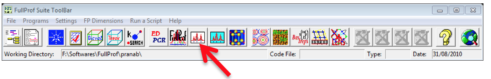

5. Then a window like shown bellow will appear:

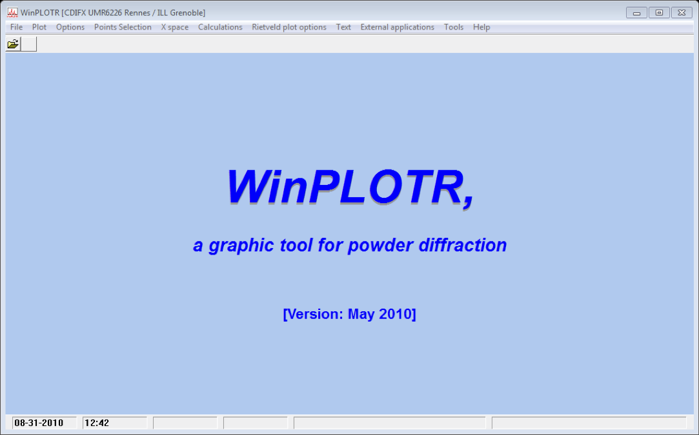

6. Then go to **File >> Open Pattern** File and select the first option **X,Y
data + INSTRM=10** and Click **OK**

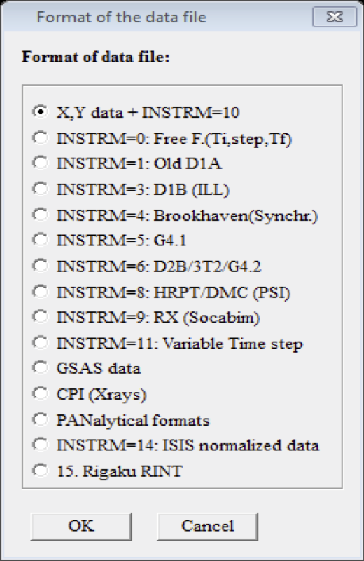

7. Now a browser window will pop-up and you have to browse the data file (Here
in our case it is `CeMg3.dat`)

8. A plot window will appear

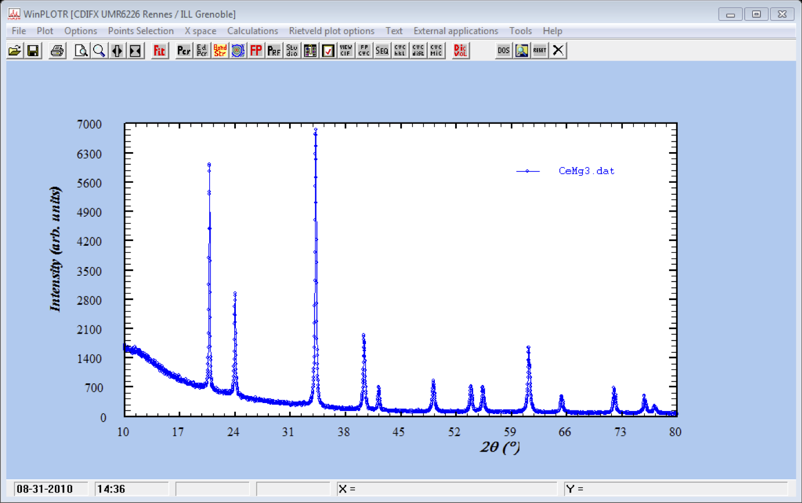

9. Go to **Points Selection >> Automatic Peak Search**. Then following window
will appear, select **Search Cu Ka1/Ka2 doublets** and leave the remaining
parameters as defaults for the first time and Click OK.

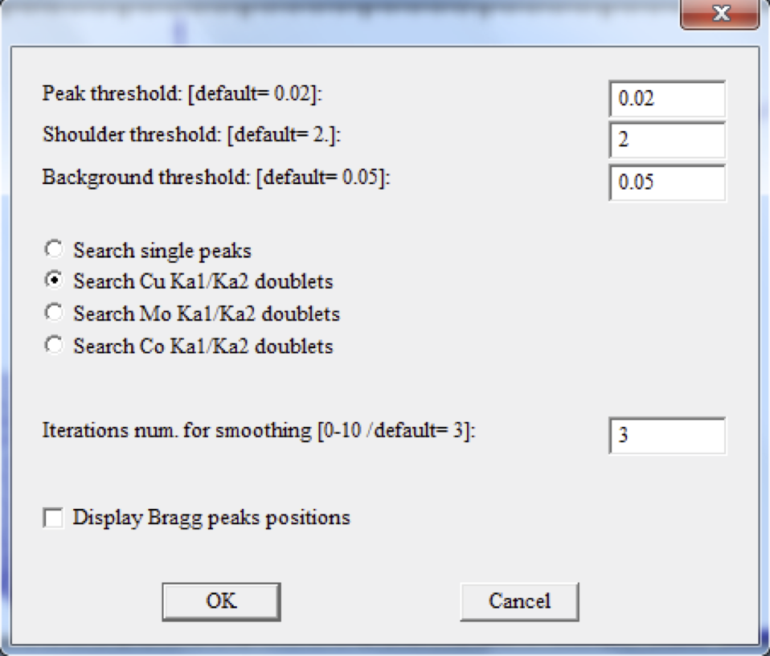

10. Now it will show, how many peak it has found, if the peak number is large or
small, you can play with various parameters, especially Iterations num. **Note:
the maximum number of peak must be bellow 20**.

11. Once you have got the right no. of peaks (say, 12 or 14), you can go ahead.

12. Now, you have to save this, for this, go to
**Points Selection >> Save as… >> Save Points for DICVOL06**. A pop-up window
will appear, put a title, select the **Tested Crystal Symmetry** (If it's known,
like in our case of CeMg3 it's Cubic. And click OK.

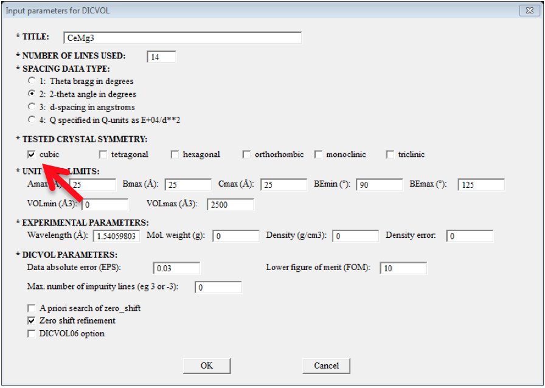

13. A pop-up window will appear saying **CeMg3.dic file has been created**,
click ok, Next pop-up will say **Edit DICVOL06 input file edit?** Click **NO**.
Finally, click **RUN** in the next pop-up window while asking **Run DICVOL06?**
If you get a solution, click **OK**.

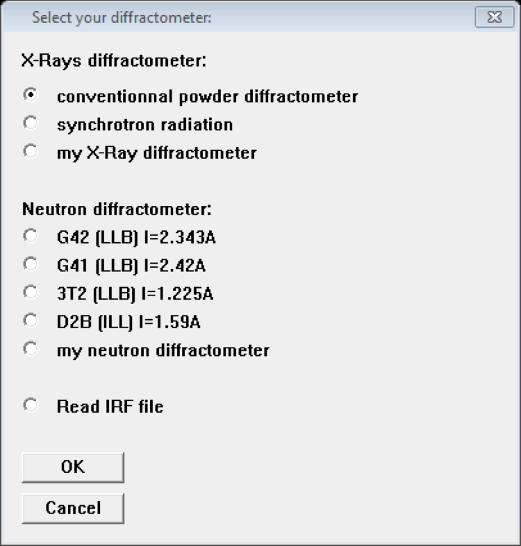

14. Sometimes, it may happen that you end up with no solution, then go back step
12 and put the maximum number of impurity peak =1 (increase it step by step if
you don't get no solution again)

15. After clicking **OK**, in the step 13, a pop-up window will say **Normal end
of DICVOL6?** Click **Kenavo!**

16. Now the required PCR file has been created in our directory.

#### Editing the PCR File
Here we will use FullProf PCR Editor (Graphical User Interface) to edit the PCR
file.

1. Click the ED PCR button in the FullProf Suite Toolbar:

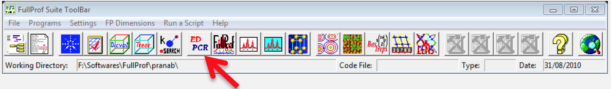

2. Following window will appear:

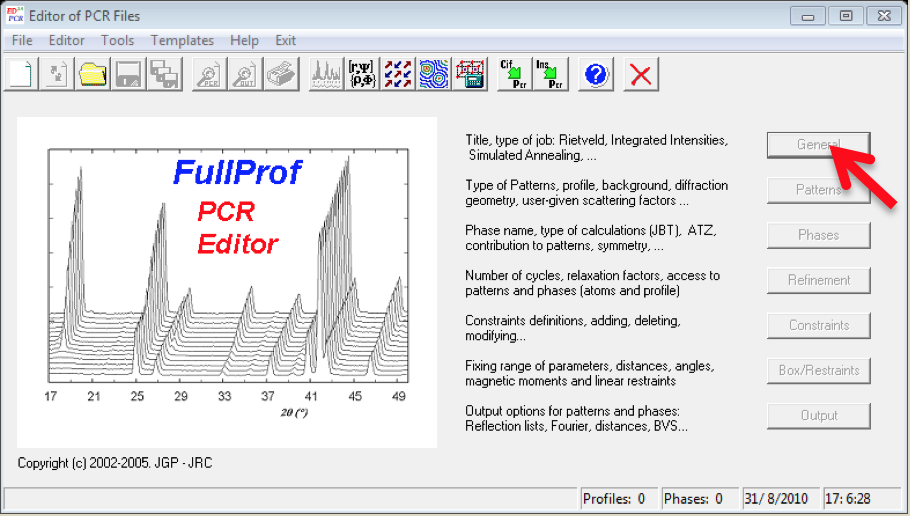

3. Now, go to **File >> Open…**, a browser window will appear, browse the PCR
file which we have created earlier.

4. Click in the **General** TAB, give a title (say, CeMg3) and click **OK**.

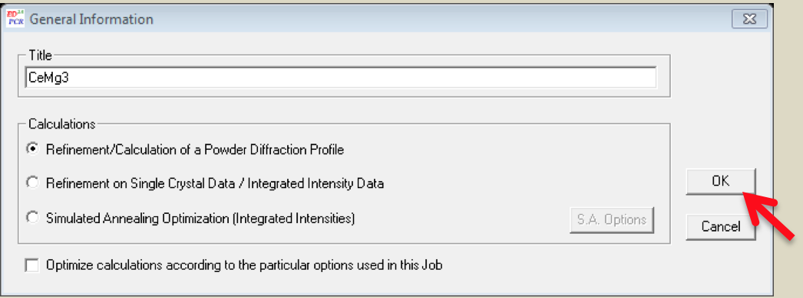

5. Then go to **Patterns** TAB in the Editor of the PCR File, following window
will appear:

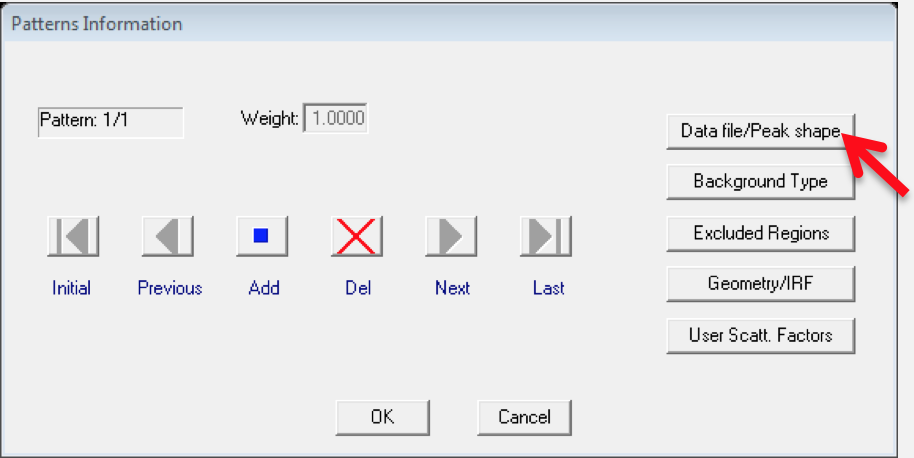

6. Click the Data file/Peak shape button:

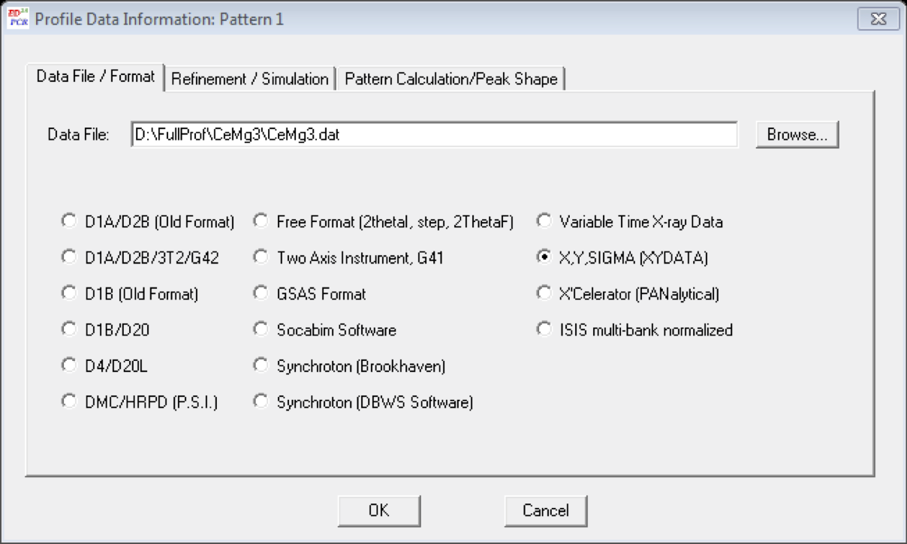

7. Another pop-up window will appear, in the **Data File/Format** TAB browse the
data file, in our case `D:\FullProf\CeMg3\CeMg3.dat`

8. Next, go to Refinement/Simulation TAB, put λ2=1.5444 and (I_2/I_1)=0.5
(specific to my case)

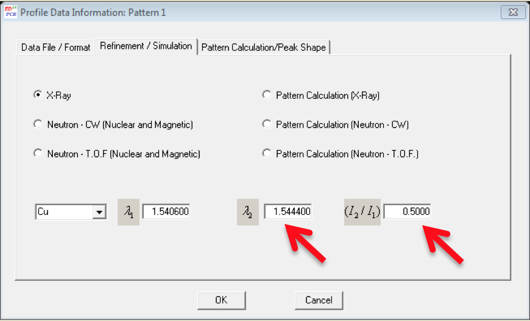

9. Click OK in the Profile Data Information Pattern window.

10. Now click in the **Background Type** button in the **Pattern Information**
window, following window will appear, select **6-Coefficients polynomial
function** and click **OK**.

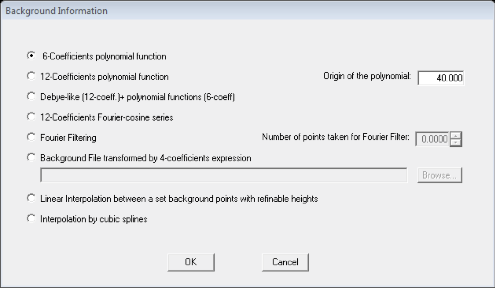

11. Now, click in the Excluded regions button and enter excluded regions in the
pop-up window, in our case, 0 - 10 and 80 - 180 are the excluded regions.

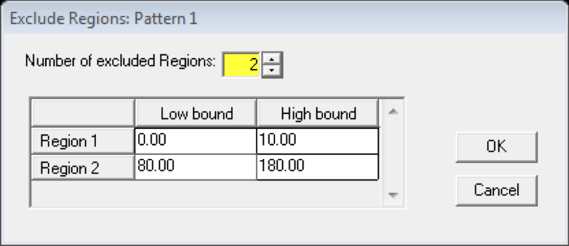

12. Click **OK** in the **Exclude Regions** window and in the **Patter
Information** window.

13. Next, come to the **Phases** button in the **Editor of PCR Files** and click
**Symmetry** button in the pop-up

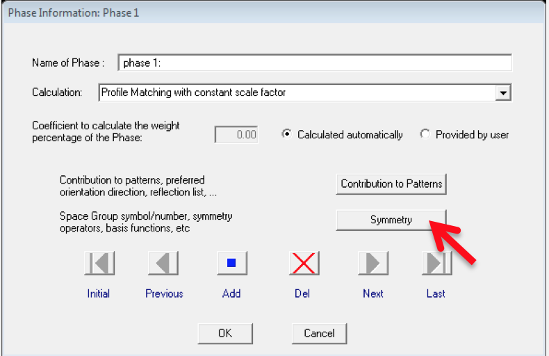

14. Enter the **SpaceGroup** information, in our case it is F m -3 m .
Click OK >> OK

15. Now go to  **Refinement** Button >> **Instrumental** button in the
**Refinement Information window**.

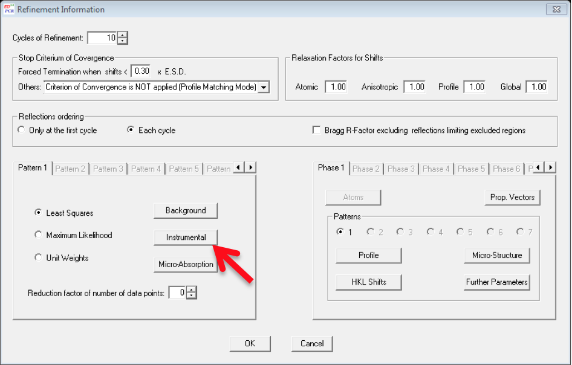

16. Select the **Zero** Check box and click OK. First, we are going to refine
only the zero point of the detector.

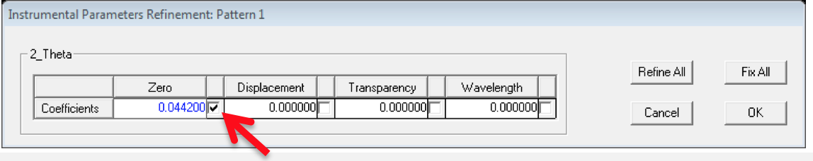

17. Click OK >> OK and come to the Editor of PCR Files window, go to File >>
Save. Now you can exit the Editor window.

#### Refinement

Here we will learn how to do the basic refinements

1. Run the **Winplotr** by clicking the **WinPlotr** button in the FullProf
Suite toolbar.

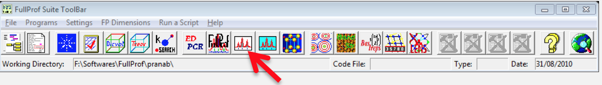

2. Click the Pcr button to browse and open the pcr in a notepad.

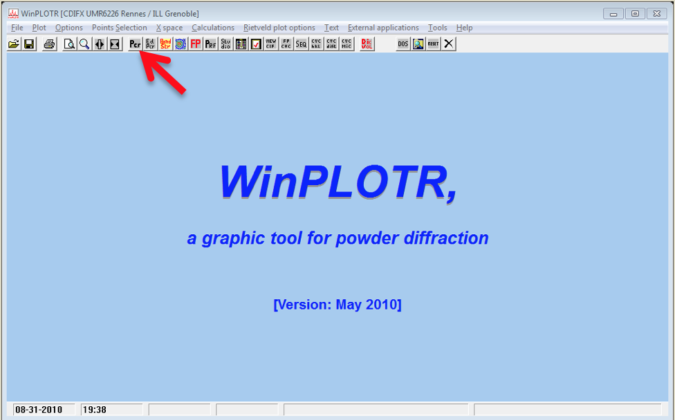

3. Now, the pcr file will open in NotePad, put Aut =1 (Doing so, you don't need
to put the index of refine parameter manually).

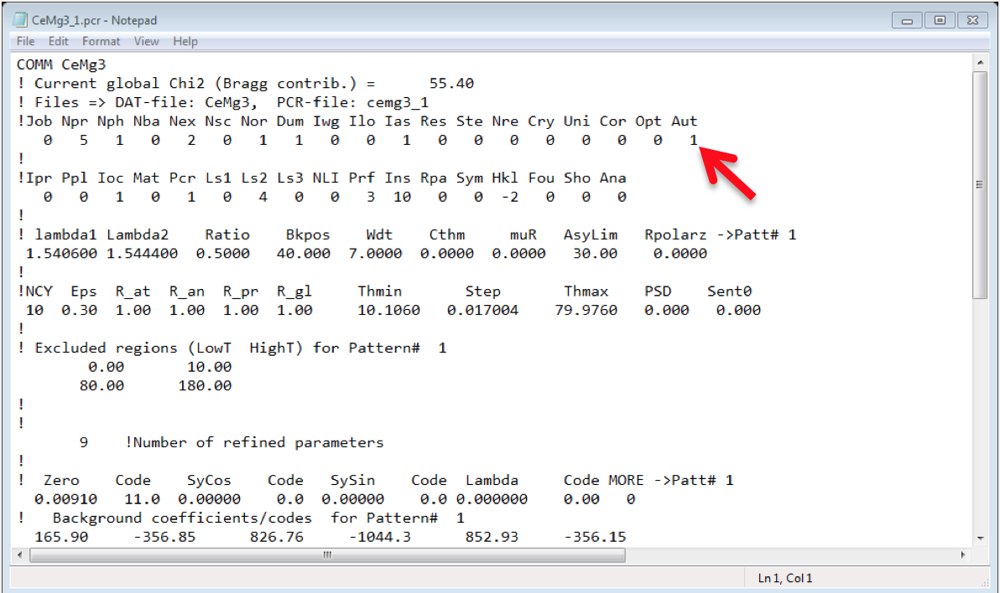

4. Save and Close the NotePad.

5. Click the **FP** button in the **WinPlotr** toolbar, it will ask for the pcr
file and the data file, browse those files.

6. Then it will show the fitted pattern as well as the experimental pattern. It
will also show the value of Chi2, recall that for the first time we are only
varying the zero error of the instrument.

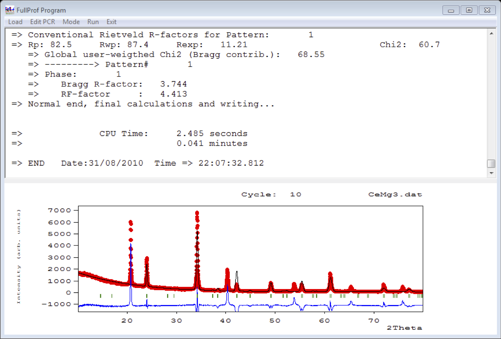

7. Go back to the Pcr button and open the pcr file in NotePad to edit it. This
time we will refine the background parameters one by one. For this change the
value of 1st background parameter to 1 instead of 0.

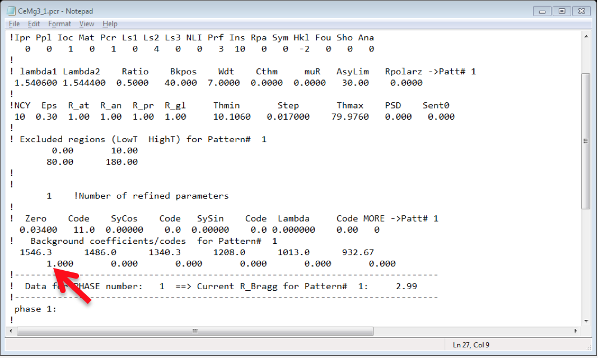

8. Save and Close the NotePad and run the FP again, like this we can refine all
the background parameters, generally one can maintain this order for best
results:
**Zero Point of the Detector >> Background Parameters >> Lattice Constants >>
Atomic Positions >> Debye-Waller factor >> Peak Shape >> Asymmetry Parameters**.
