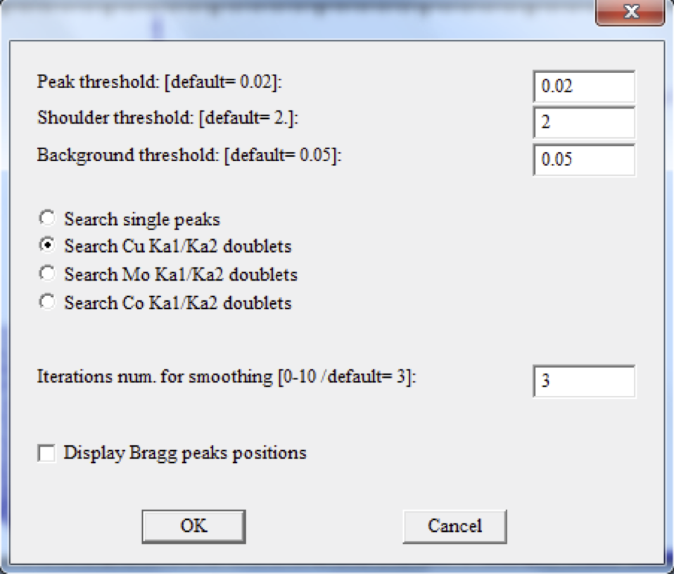

# Creating PCR File

1. First of all, it is recommended that you always create a new (separate) directory for the FullProf analysis of each of your samples. Like for example, now I want to do the analysis of CeMg3, so I will create `D:\FullProf\CeMg3`

2. Copy the powder XRD data file to the folder created (i.e., to `D:\FullProf\CeMg3`). Generally, this XRD data file is an ASCII file with the extension **.x_y** or **.ASC**, containing data in two column format, it will be better to change the file extension to **.dat**.

3. Now run the fullProf Program, then the FullProf toolbar will appear.

4. Click the **WinPlotr** icon to run **WinPlotr**.

  

5. Then a window like shown bellow will appear:

  

6. Then go to **File >> Open Pattern** File and select the first option **X,Y data + INSTRM=10** and Click **OK**

  

7. Now a browser window will pop-up and you have to browse the data file (Here in our case it is **CeMg3.dat**)

8. A plot window will appear

  

9. Go to **Points Selection >> Automatic Peak Search**. Then following window will appear, select **Search Cu Ka1/Ka2 doublets** and leave the remaining parameters as defaults for the first time and Click OK.

  

10. Now it will show, how many peak it has found, if the peak number is large or small, you can play with various parameters, especially Iterations num. ***Note: the maximum number of peak must be bellow 20***.

11. Once you have got the right no. of peaks (say, 12 or 14), you can go ahead.

12. Now, you have to save this, for this, go to **Points Selection >> Save as… >> Save Points for DICVOL06**. A pop-up window will appear, put a title, select the **Tested Crystal Symmetry** (If it's known, like in our case of CeMg3 it's Cubic. And click OK.

  

13. A pop-up window will appear saying **CeMg3.dic file has been created**, click ok, Next pop-up will say **Edit DICVOL06 input file edit?** Click **NO**. Finally, click **RUN** in the next pop-up window while asking **Run DICVOL06?** If you get a solution, click **OK**.
  

14. Sometimes, it may happen that you end up with no solution, then go back step 12 and put the maximum number of impurity peak =1 (increase it step by step if you don't get no solution again)

15. After clicking **OK**, in the step 13, a pop-up window will say **Normal end of DICVOL6?** Click **Kenavo!**

16. Now the required PCR file has been created in our directory.
