# Editing the PCR File
Here we will use FullProf PCR Editor (Graphical User Interface) to edit the PCR file.

1. Click the ED PCR button in the FullProf Suite Toolbar:  
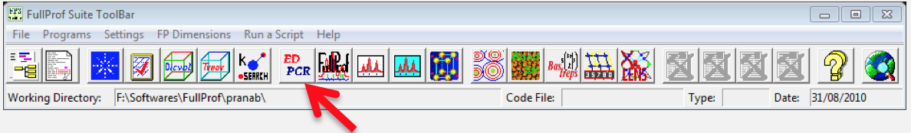  

2. Following window will appear:  
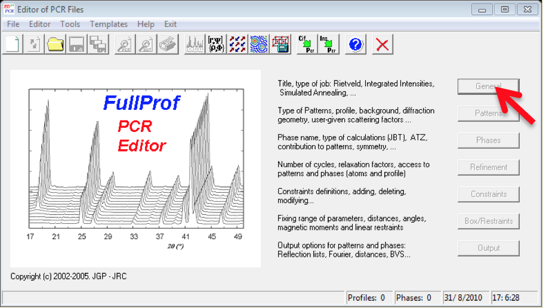{:style="width:400px;"} 

3. Now, go to **File >> Open…**, a browser window will appear, browse the PCR file which we have created earlier.

4. Click in the **General** TAB, give a title (say, CeMg3) and click **OK**.  
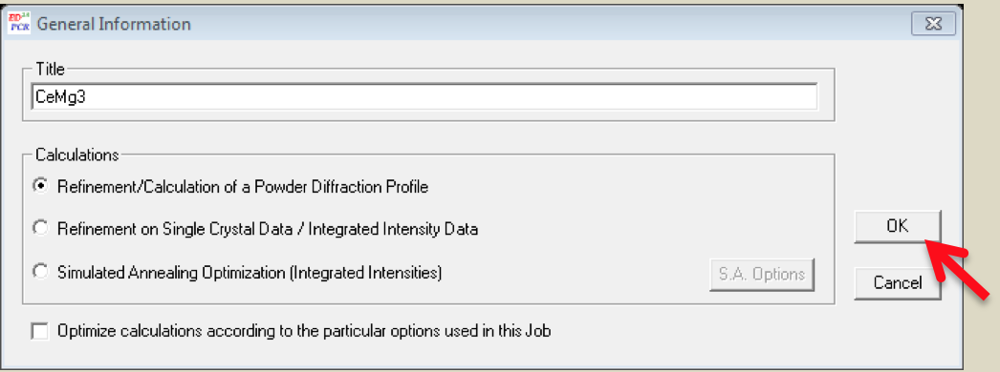{:style="width:400px;"} 

5. Then go to **Patterns** TAB in the Editor of the PCR File, following window will appear:  
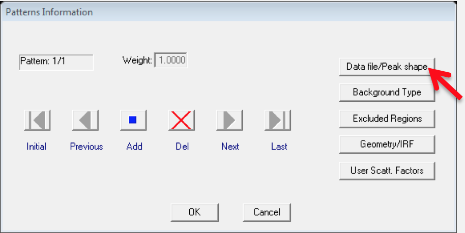{:style="width:400px;"} 

6. Click the Data file/Peak shape button:  
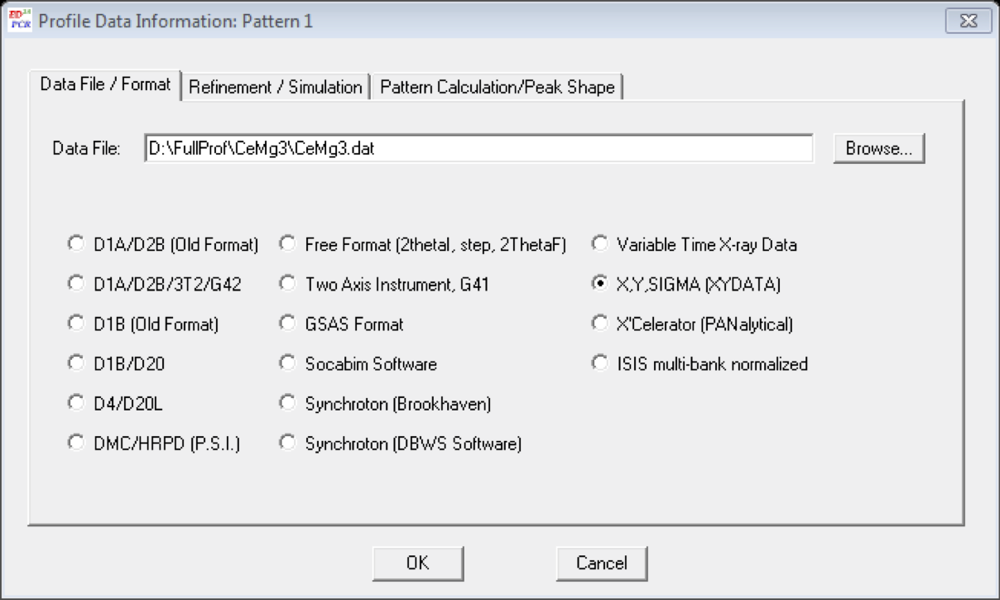{:style="width:400px;"}  

7. Another pop-up window will appear, in the **Data File/Format** TAB browse the data file, in our case `D:\FullProf\CeMg3\CeMg3.dat`

8. Next, go to Refinement/Simulation TAB, put λ2=1.5444 and (I_2/I_1)=0.5 (specific to my case)  
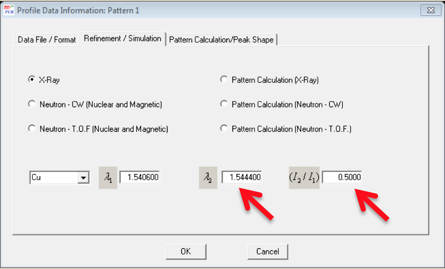{:style="width:400px;"}  

9. Click OK in the Profile Data Information Pattern window.

10. Now click in the **Background Type** button in the **Pattern Information** window, following window will appear, select **6-Coefficients polynomial function** and click **OK**.  
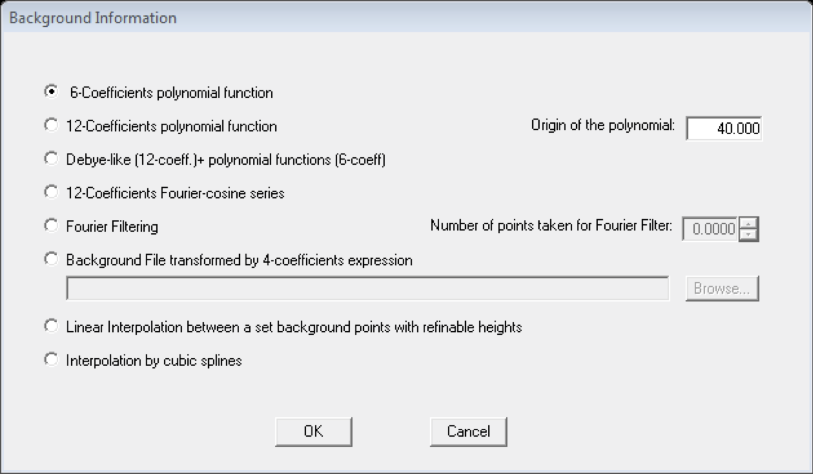{:style="width:400px;"} 

11. Now, click in the Excluded regions button and enter excluded regions in the pop-up window, in our case, 0 - 10 and 80 - 180 are the excluded regions.  
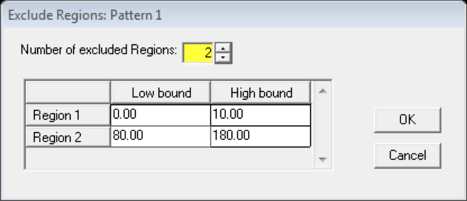{:style="width:400px;"} 

12. Click **OK** in the **Exclude Regions** window and in the **Patter Information** window.

13. Next, come to the **Phases** button in the **Editor of PCR Files** and click **Symmetry** button in the pop-up  
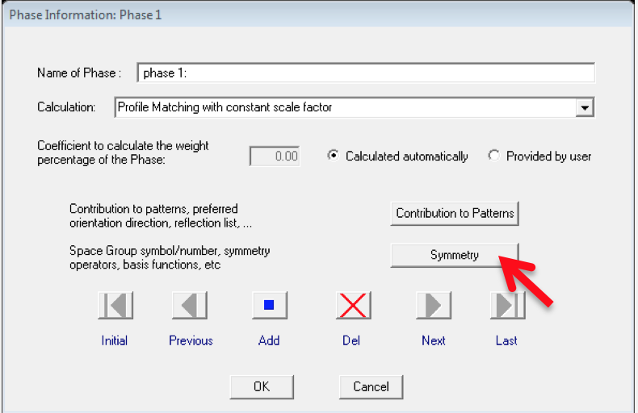{:style="width:400px;"} 

14. Enter the **SpaceGroup** information, in our case it is F m -3 m . Click OK >> OK

15. Now go to  **Refinement** Button >> **Instrumental** button in the **Refinement Information window**.  
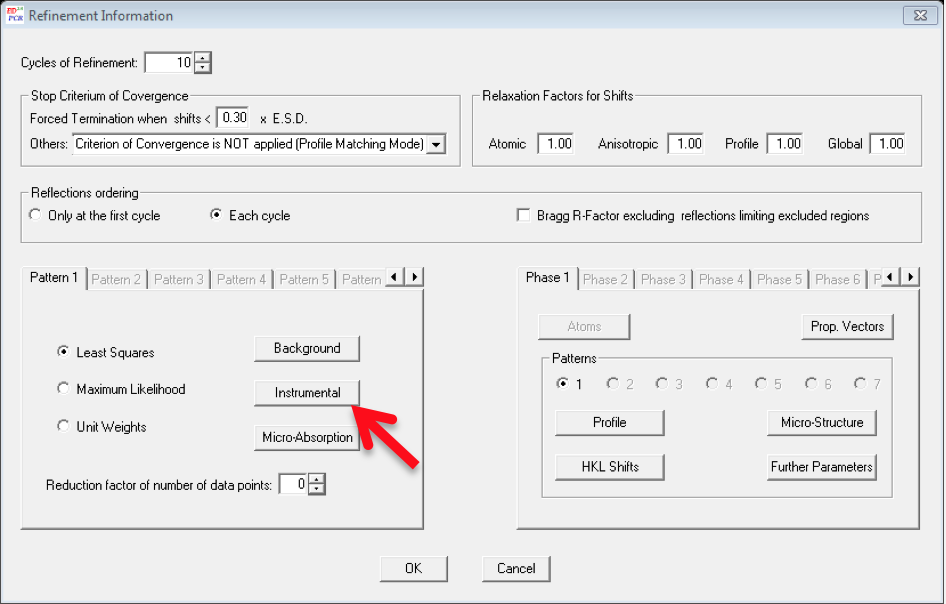{:style="width:400px;"} 

16. Select the **Zero** Check box and click OK. First, we are going to refine only the zero point of the detector.  
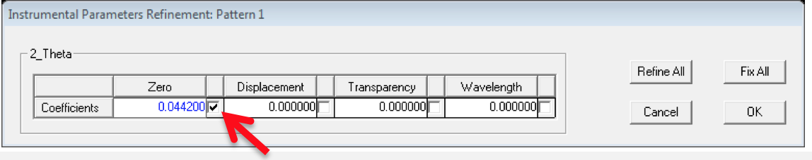{:style="width:400px;"} 

17. Click OK >> OK and come to the Editor of PCR Files window, go to File >> Save. Now you can exit the Editor window.
