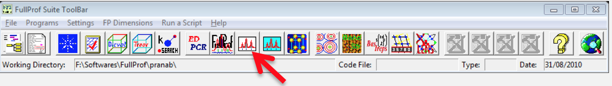
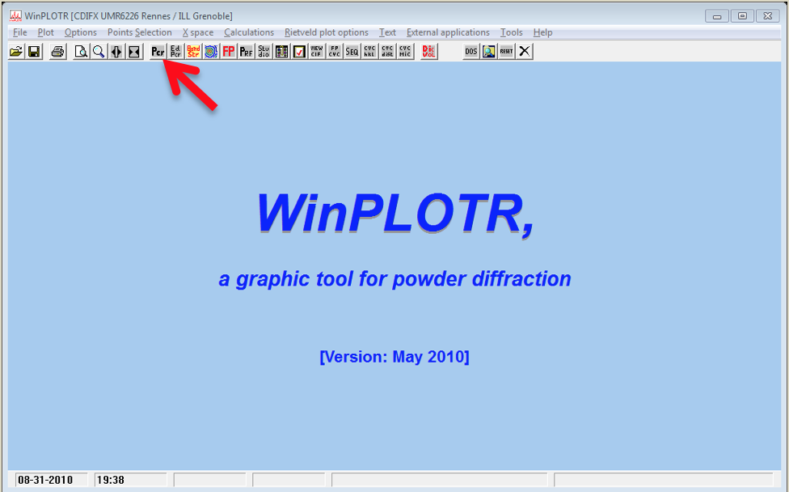
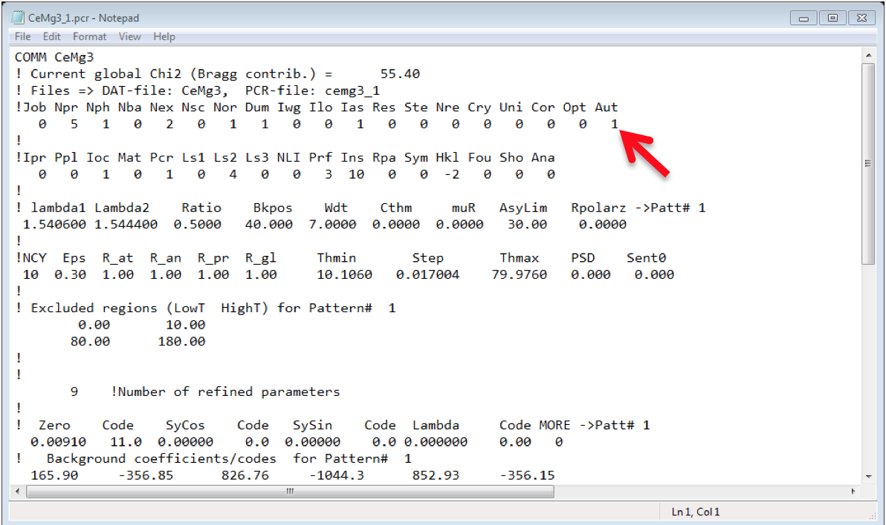
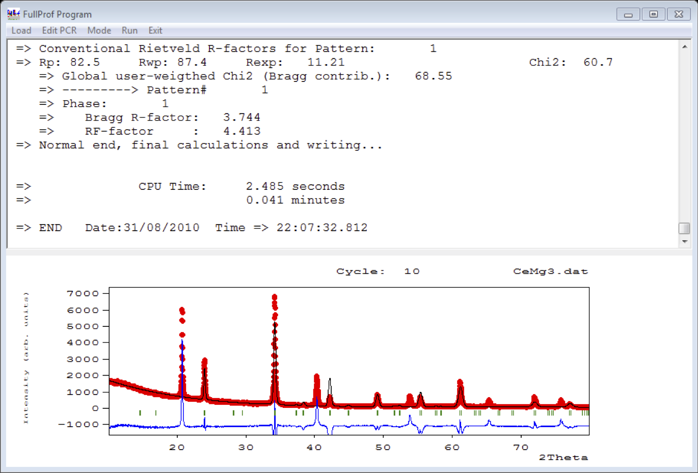
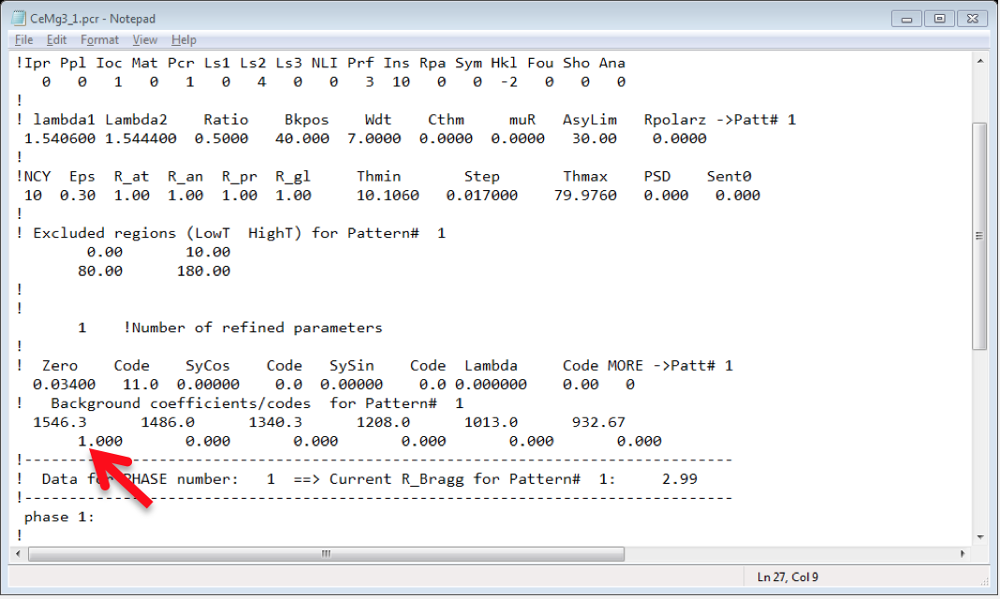

# Refinement

Here we will learn how to do the basic refinements

1. Run the **Winplotr** by clicking the **WinPlotr** button in the FullProf Suite toolbar.

  

2. Click the Pcr button to browse and open the pcr in a notepad.

  

3. Now, the pcr file will open in NotePad, put Aut =1 (Doing so, you don't need to put the index of refine parameter manually).

  

4. Save and Close the NotePad.

5. Click the **FP** button in the **WinPlotr** toolbar, it will ask for the pcr file and the data file, browse those files.

6. Then it will show the fitted pattern as well as the experimental pattern. It will also show the value of Chi2, recall that for the first time we are only varying the zero error of the instrument.

  

7. Go back to the Pcr button and open the pcr file in NotePad to edit it. This time we will refine the background parameters one by one. For this change the value of 1st background parameter to 1 instead of 0.

  

8. Save and Close the NotePad and run the FP again, like this we can refine all the background parameters, generally one can maintain this order for best results:
**Zero Point of the Detector >> Background Parameters >> Lattice Constants >> Atomic Positions >> Debye-Waller factor >> Peak Shape >> Asymmetry Parameters**.
